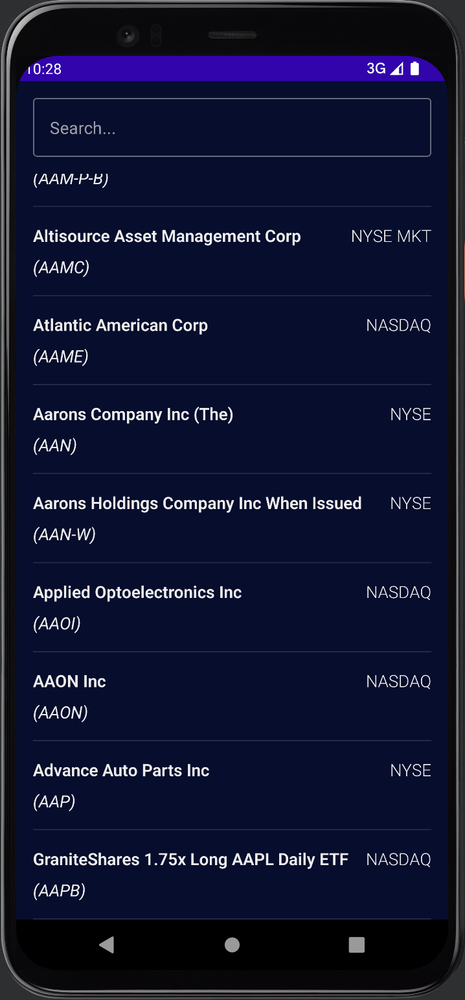
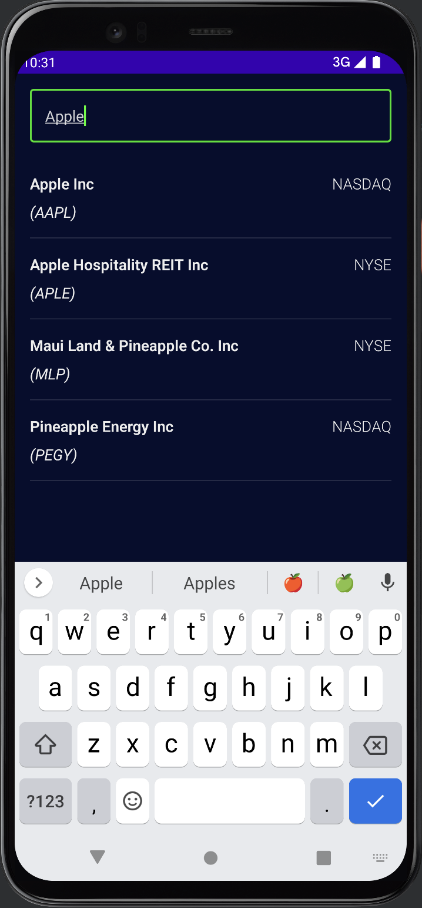
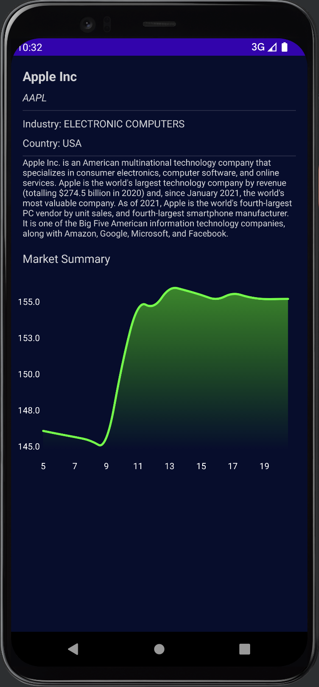

# StockMarketApp

A Jetpack Compose StockMarket Android app using a clean architecture

It is based on a very awesome android Youtube tutorial by Phillip; [How to Build a Clean Architecture Stock Market App 📈 (Jetpack Compose, Caching, SOLID)][phil_tut_ref]

## Key Features
- [Clean architecture][clean_arc_ref] with the following layers i.e. The [data layer][data_layer_ref], The [domain layer][domain_layer_ref] (NOTE: Use cases are not used) & The [presentation / ui layer][ui_layer_ref]
- [Jetpack compose] [compose_ref] views
- Navigation with the help of the [Compose Destinations library] [costa_comp_nav_ref]
- [Retrofit] [retrofit_ref] is used for Networking
- [Hilt] [hilt_ref] is used for Dependency Injection
- **Swipe to refresh** functionality is implemented using the [Accompanist library][swr_ref]
- **Search functionality** powered by _Kotlin Flows_
- A graph is drawing using the _Compose Canvas APIs_
- Offline functionality is implemented using [Room] [room_ref] as a single source of truth
- The [Alpha Vantage Stock API] [stock_api_ref] with a limited free API key is used in the app
- CSV parsing is implemented with the [OpenCSV library] [csv_ref]

## App Screens
### Company Listings Screen

### Search Company Listings

### Company Info Screen

### Demo video

https://user-images.githubusercontent.com/3297681/198876371-511553a4-8dfe-498e-95bc-9eec29fef2ec.mov

## Git Branches
The project uses a *main*, *develop* & *feature/*** branches inspired by [Git-flow-workflow][git_flow_ref].

### main
Contains the final implementation

### starter
Contains the starting implementation

### develop
The active development branch

### feature/**
The feature branches (not deleted) showing the evolution of the project implementation for each feature. All feature branches have already been merged into the development branch.

## Important Info
The API key for the Alpha Vantage is currently hardcoded. Feel free to use your own. You can get [here][get_stock_api_ref].

[phil_tut_ref]: https://www.youtube.com/watch?v=uLs2FxFSWU4
[clean_arc_ref]: https://developer.android.com/topic/architecture
[data_layer_ref]: https://developer.android.com/topic/architecture/data-layer
[domain_layer_ref]: https://developer.android.com/topic/architecture/domain-layer
[ui_layer_ref]: https://developer.android.com/topic/architecture/ui-layer
[compose_ref]: https://developer.android.com/jetpack/compose
[costa_comp_nav_ref]: https://github.com/raamcosta/compose-destinations
[retrofit_ref]: https://square.github.io/retrofit/
[hilt_ref]: https://developer.android.com/training/dependency-injection/hilt-android
[swr_ref]: https://google.github.io/accompanist/swiperefresh/
[room_ref]: https://developer.android.com/jetpack/androidx/releases/room
[stock_api_ref]: https://www.alphavantage.co
[get_stock_api_ref]: https://www.alphavantage.co/support/#api-key
[csv_ref]: https://opencsv.sourceforge.net
[git_flow_ref]: https://www.atlassian.com/de/git/tutorials/comparing-workflows/gitflow-workflow
